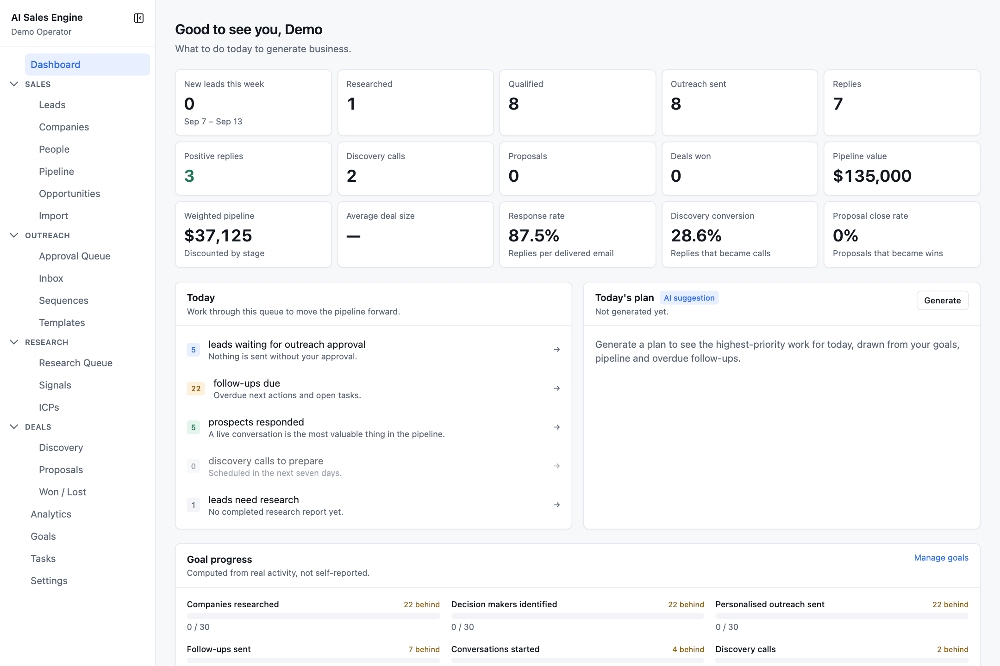

# Outbound OS — AI Sales Engine

A self-hosted outbound sales system for a small consultancy or solo operator. It researches companies, scores them against your ideal customer profile, drafts personalised outreach, reads replies, and tracks every deal to close — with **AI doing the work and a human approving anything that reaches a prospect**.



## What it does

| Area | What you get |
| --- | --- |
| **Leads & pipeline** | Companies, people, and leads with a 19-stage pipeline, a kanban board, next actions, tasks, notes, and a full activity trail. |
| **Import** | Add leads by hand, from a CSV with column mapping and duplicate detection, from an inbound website form, or let the **AI lead finder** search the web against your ICP. |
| **Research agent** | Crawls a company's site and the web, produces a sourced report where every claim is typed **FACT / INFERENCE / UNKNOWN**, detects pain signals, finds decision makers, and generates opportunities. |
| **Lead scoring** | Deterministic fit and opportunity scores from evidence, with a one-line rationale per factor. Weights live on the ICP. |
| **Outreach** | AI drafts emails in a fixed observation → hypothesis → question → CTA shape. Every draft waits in an **approval queue**; nothing sends without a person clicking Approve. |
| **Inbox** | Replies are matched to leads and classified (interested, needs info, not now, unsubscribe, bounce…). Opt-outs and bounces are handled mechanically before any AI runs. |
| **Sequences** | Multi-step follow-ups by day offset. Every step still lands in the approval queue, and an enrolment pauses the moment the prospect replies. |
| **Compliance** | Sender identity, physical address, opt-out footer, daily send limit, and a suppression list — all enforced server-side before a send. |
| **Deals** | Discovery call prep, opportunities with an ROI calculator, proposals, won/lost analysis with loss reasons. |
| **Analytics & goals** | Measured funnel, revenue, outreach rates, breakdowns by industry/ICP/source, plus weekly goals with pace tracking. |
| **Providers** | Runs fully offline on **mock** providers. Swap in Anthropic or Gemini for AI, Gmail for email, Brave or Serper for search. |

## Quick start

Prerequisites: Node 20+, Docker (for Postgres and Redis).

```bash
git clone https://github.com/Abduboriy1/outbound-os.git
cd outbound-os
npm install                 # also runs prisma generate + nuxt prepare
cp .env.example .env        # defaults run everything on mock providers
npm run db:up               # postgres :55432 + redis :56379 in docker
npm run db:migrate
npm run db:seed             # demo data + demo@example.com / demo12345
npm run dev                 # http://localhost:3000
```

Optional second terminal for background jobs (research runs inline without it, just slower):

```bash
npm run worker
```

Or do all of the above in one go:

```bash
npm run dev:all
```

Log in with `demo@example.com` / `demo12345`. Everything works on the mock providers — the AI, email, and search are simulated deterministically so you can click through the whole flow without an API key. See [Getting started](docs/getting-started.md) for the full walkthrough and [Configuration](docs/configuration.md) to connect real providers.

## Documentation

The [`docs/`](docs/README.md) folder has one guide per area, with screenshots.

| Guide | Covers |
| --- | --- |
| [Getting started](docs/getting-started.md) | Install, environment, database, seed data, dev server, worker, production build |
| [Configuration](docs/configuration.md) | Every environment variable, AI / email / search providers, Gmail OAuth setup, website intake API |
| [Core concepts](docs/concepts.md) | Pipeline stages, lead scoring, ICPs, claim types, the human-approval rule, mock mode |
| [Dashboard](docs/dashboard.md) | Metrics, the Today queue, AI daily plan, goal progress |
| [Sales](docs/sales.md) | Leads, the lead workspace, companies, people, pipeline board, opportunities, import |
| [Research](docs/research.md) | ICPs and the AI interview, research reports, the research queue, signals, the AI lead finder |
| [Outreach](docs/outreach.md) | Approval queue, inbox and reply intelligence, sequences, templates and objections, compliance |
| [Deals](docs/deals.md) | Discovery, ROI calculator, proposals, won / lost |
| [Analytics, goals, tasks](docs/analytics-goals-tasks.md) | Every chart and table, goal pacing, the task list |
| [Settings](docs/settings.md) | Overview, integrations, email, AI, automation, compliance |
| [Architecture](docs/architecture.md) | Stack, folder layout, queue and worker, AI trust boundary, audit and debug logs, tests, API surface |
| [Known limitations](docs/known-limitations.md) | Things that are modelled but not yet wired up, and honest caveats |

## Tech stack

Nuxt 4 · Vue 3 · TypeScript · PrimeVue 4 (MIT line) · Tailwind CSS 4 · Prisma 7 · PostgreSQL 17 · Redis 7 + BullMQ · Chart.js · Vitest · Anthropic SDK · Google GenAI SDK · Gmail API

## Scripts

| Command | What it does |
| --- | --- |
| `npm run dev` | Nuxt dev server on port 3000 |
| `npm run worker` | Background job worker (research, scoring, stale-lead sweeps) |
| `npm run dev:all` | Docker up, migrate, then dev + worker together |
| `npm run build` / `npm start` | Production build and run |
| `npm run db:up` / `db:down` | Start / stop Postgres and Redis containers |
| `npm run db:migrate` / `db:deploy` | Apply migrations (dev / production) |
| `npm run db:seed` / `db:reset` | Seed demo data / wipe and reseed |
| `npm run db:studio` | Prisma Studio |
| `npm test` / `test:watch` | Vitest (no database needed) |
| `npm run lint` / `typecheck` | ESLint / `nuxt typecheck` |

## Design principles

- **A human approves anything that reaches a prospect.** There is exactly one code path that sends email, and it is only reachable from the approval endpoint.
- **AI output is an argument, not a fact.** Claims are typed and sourced; ROI figures are labelled *our estimate* until the prospect confirms them; every AI run is recorded with the input it was actually given.
- **Prospect data is untrusted.** Scraped pages and inbound emails never enter a system prompt; instruction-shaped text found in them is stripped and flagged.
- **Compliance is not optional.** Sender identity, postal address, opt-out line, suppression list, and daily cap are enforced server-side on every send.
- **Works with zero keys.** Mock providers are deterministic and clearly labelled, so the full pipeline can be demoed and tested offline.

## Contributing

Issues and pull requests are welcome. Run `npm test`, `npm run lint`, and `npm run typecheck` before opening a PR.

## License

[MIT](LICENSE) © 2026 Bory.

You can use, modify, self-host, sell, or build a product on top of this project, including commercially — the only requirement is keeping the copyright and license notice. If you feature it in a video, article, or product, a link back to this repository is appreciated.
