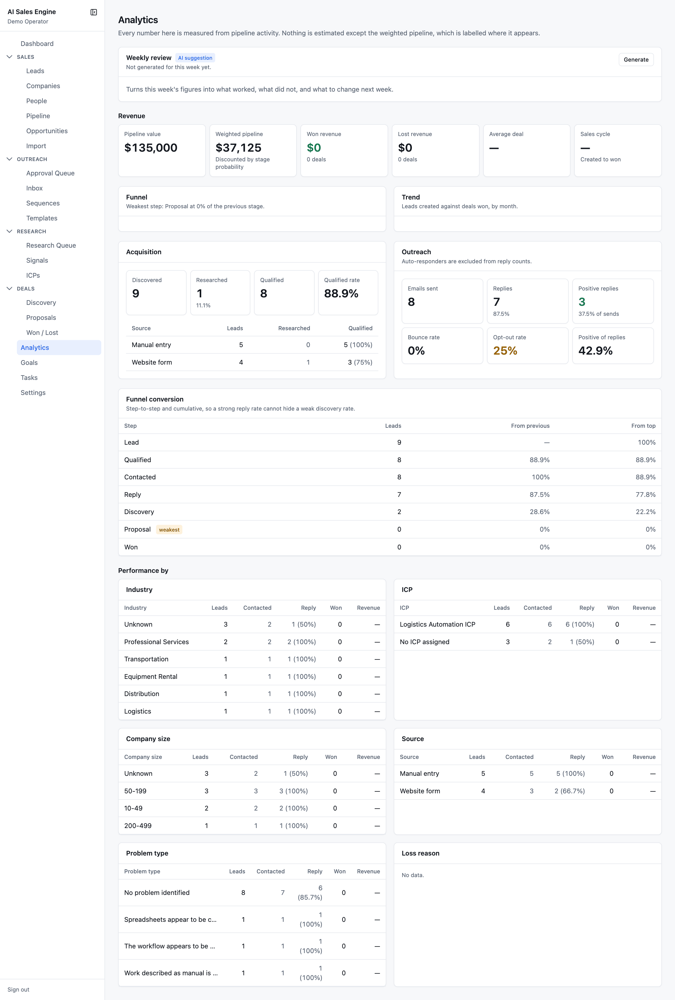
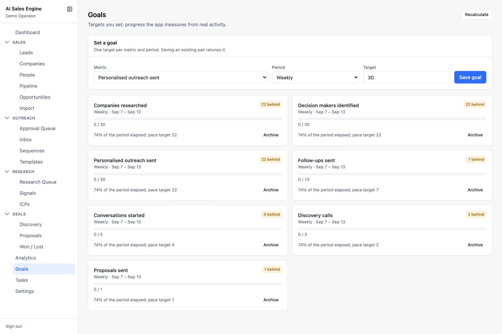
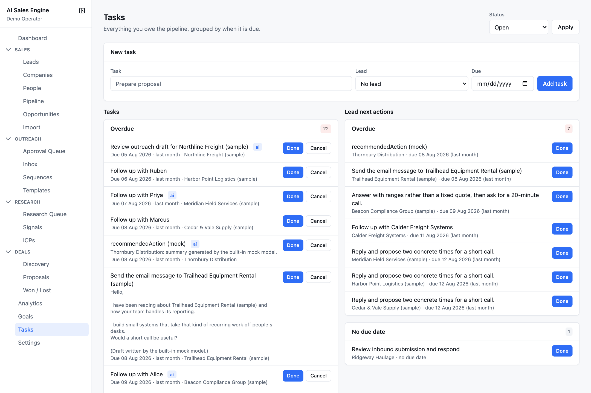

# Analytics, goals, and tasks

- [Analytics](#analytics)
- [Goals](#goals)
- [Tasks](#tasks)

---

## Analytics

`/analytics` — *every number here is measured from pipeline activity. Nothing is estimated except the weighted pipeline, which is labelled where it appears.*

### Weekly review (AI)

Turns this week's figures into *what worked, what did not, and what to change next week*: best performing ICP, industries that responded, messages that produced replies, where deals stalled, most common objection, and a single **Change next week**. Badged **AI suggestion**. Press **Generate** (or **Regenerate**); only a review generated in the current ISO week is shown, and every claim should be checkable against the tables below.

### Revenue

Pipeline value · Weighted pipeline (*discounted by stage probability*) · Won revenue · Lost revenue · Average deal · Sales cycle (created to won).

### Funnel

Seven steps: **Lead → Qualified → Contacted → Reply → Discovery → Proposal → Won**. A lead counts for a step if it *ever* reached that stage or beyond, read from stage history — so a deal that is now Lost still appears in every step it passed through. The card names the weakest step; the **Funnel conversion** table shows step-to-step and cumulative rates so a strong reply rate cannot hide a weak discovery rate.

### Trend

Leads created against deals won, by month, over the last twelve months, with won revenue as a line on a second axis.

### Acquisition

Discovered · Researched · Qualified · Qualified rate, then a table by source (manual, CSV, website form, referral, search provider, directory, job posting, conference, existing contact).

### Outreach

Emails sent · Replies · Positive replies · Bounce rate (red above 3%) · Opt-out rate (amber above 1%) · Positive share of replies. Rates are against *delivered* mail. Positive means Interested, Needs info, Question, or Referred on. Auto-replies and out-of-office are excluded from reply counts entirely.

### Performance by

Six tables — **Industry**, **ICP**, **Company size**, **Source**, **Problem type**, **Loss reason** — each with leads, contacted, reply (and rate), won, and revenue. Unknowns are bucketed explicitly (*Unknown*, *No ICP assigned*, *No problem identified*, *Not recorded*). Size bands: 1–9, 10–49, 50–199, 200–499, 500–999, 1000+.

---

## Goals

`/goals` — targets you set; progress the app measures from real activity.

### Metrics

| Metric | Counted from | Moves it |
| --- | --- | --- |
| Companies researched | completed research reports | Research queue |
| Decision makers identified | contacts created | People |
| Personalised outreach sent | sent first-touch drafts | Approval queue |
| Follow-ups sent | sent follow-up drafts | Tasks |
| Replies received | inbound, non-bounced messages | Inbox |
| Conversations started | threads that received a reply | Inbox |
| Discovery calls | meetings, at their scheduled time | Discovery |
| Proposals sent | proposals with a sent date | Proposals |
| Deals won | leads won in the window | Won / Lost |

### Periods and pacing

Daily, weekly (ISO weeks starting Monday), monthly, quarterly — all in UTC. A goal card shows `12 / 30`, the percentage of the period elapsed, and the **pace target** (`round(target × elapsed)`). It is **On pace** when the value is at or above the pace target, otherwise **N behind**.

**Set a goal**: pick a metric, a period, and a target; saving an existing pair retunes it. **Recalculate** refreshes every active goal from live activity. **Archive** retires a goal; **Reactivate** brings it back with its target.

**Previous periods** lists frozen snapshots of closed windows. Nothing is recalculated retroactively.

Suggested starter set: weekly — 30 companies researched, 30 decision makers identified, 30 personalised outreaches, 3 discovery calls, 1 proposal.

---

## Tasks

`/tasks` — everything you owe the pipeline, grouped by when it is due.

- **Status** filter: Open · Done · Cancelled · All (in the URL, so a view is linkable).
- **New task**: title, optional lead, optional due date.
- **Tasks** column: grouped **Overdue** (red badge) · **Today** · **Upcoming** · **No due date**. Each row: title (with an **ai** badge when an agent created it), detail, due date, company link. Buttons: **Done** and **Cancel** on open tasks; **Reopen** on closed ones.
- **Lead next actions** column: every lead's single free-text next action, grouped the same way. **Done** clears it. **Find leads without one** opens the leads list filtered to *No next action*.

Tasks are also created automatically: after a send (the 4 / 6 / 10 / 20-day no-reply ladder), after a reply (by intent), by the stale-lead sweep (*Lead has gone quiet*), by the follow-up sweep (*Decide the next step for …*), and by approving a LinkedIn draft for manual send.
