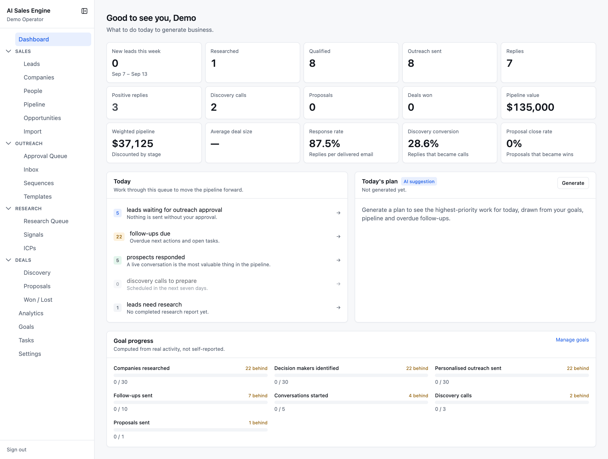

# Dashboard

`/` — the first page after login. Its job is to answer "what should I do today to generate business?"

## Metric tiles

Fifteen measured figures, computed from real activity (none are placeholders):

| Row 1 | Row 2 | Row 3 |
| --- | --- | --- |
| New leads this week (with the week's date range) | Positive replies | Weighted pipeline — *discounted by stage* |
| Researched | Discovery calls | Average deal size |
| Qualified | Proposals | Response rate — *replies per delivered email* |
| Outreach sent | Deals won | Discovery conversion — *replies that became calls* |
| Replies | Pipeline value | Proposal close rate — *proposals that became wins* |

Positive replies and Deals won turn green when above zero.

## Today

A queue of what is waiting, each row a link with a count badge. Zero-count rows are dimmed.

| Row | Goes to | Counts |
| --- | --- | --- |
| leads waiting for outreach approval | Approval Queue | drafts pending approval |
| follow-ups due | Tasks | overdue open tasks, or follow-ups due today or overdue, whichever is larger |
| prospects responded | Inbox | leads at stage Responded |
| discovery calls to prepare | Deals → Discovery | meetings in the next seven days |
| leads need research | Research Queue | leads at Prospect or Researching |

When nothing is waiting the card says *"Nothing is waiting. Add leads or start research to fill the queue."*

## Today's plan (AI)

Press **Generate** (later **Regenerate**) to run the sales-coach agent. It reads your goals, pipeline, and overdue follow-ups and returns:

- a headline
- a ranked list of priorities, each an action plus a reason; actions naming a lead link to it
- a *Pipeline observation*
- a goal-status grid (current / target with a comment)
- a *Risks* list

Only plans from the last 24 hours are shown. The card is badged **AI suggestion** and the sub-line reads *"Generated N minutes ago by <model>. Review before acting."*

## Goal progress

Each active goal shows its metric (linked to the page that moves it), an **On pace** or **N behind** badge, and a progress bar. **Manage goals** opens the [Goals](analytics-goals-tasks.md#goals) page. Progress is *computed from real activity, not self-reported*.

## Navigation

The left sidebar is grouped: **Dashboard** · **Sales** (Leads, Companies, People, Pipeline, Opportunities, Import) · **Outreach** (Approval Queue, Inbox, Sequences, Templates) · **Research** (Research Queue, Signals, ICPs) · **Deals** (Discovery, Proposals, Won / Lost) · then Analytics, Goals, Tasks, Settings. Sections collapse; a collapsed section reopens when you navigate into it. The sidebar itself collapses with the button next to the app name, and **Sign out** is at the bottom. On narrow screens the same navigation opens as a drawer.
