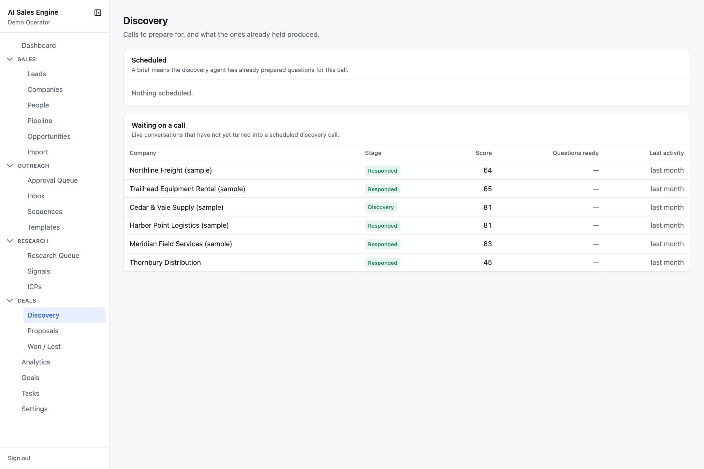
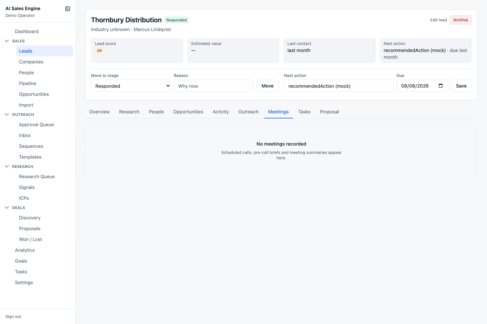
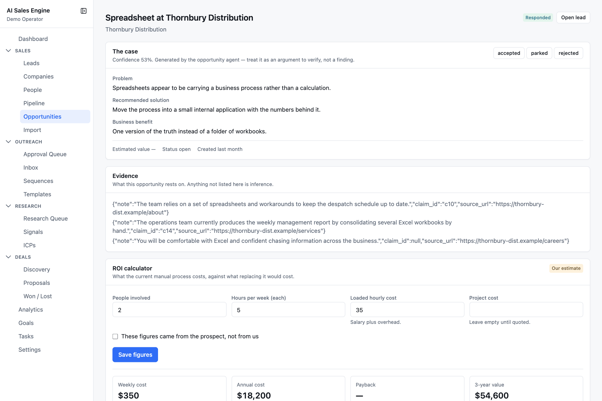
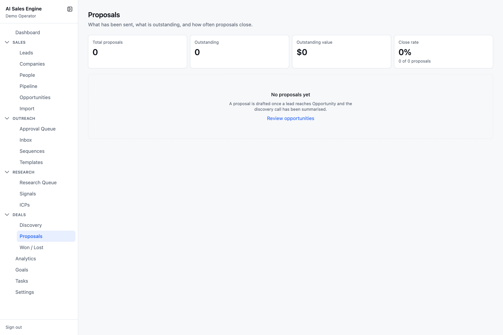
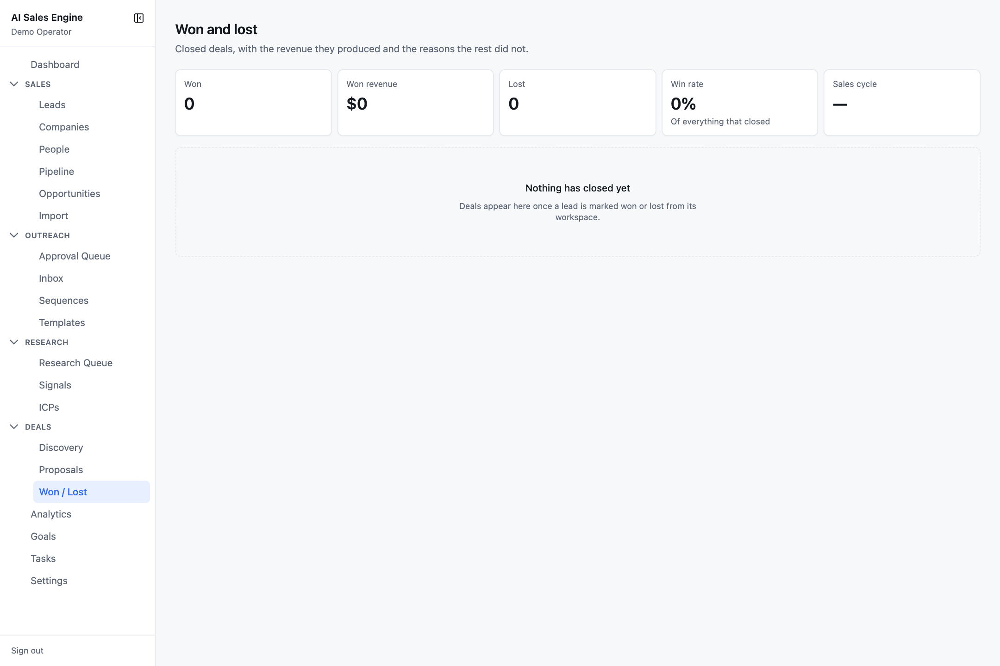

# Deals

The **Deals** section tracks a lead from a live conversation to a closed outcome: discovery calls, the opportunity's business case and ROI, proposals, and won / lost analysis.

- [Discovery](#discovery)
- [ROI calculator](#roi-calculator)
- [Proposals](#proposals)
- [Won / Lost](#won--lost)

---

## Discovery

`/deals/discovery` — calls to prepare for, and what the ones already held produced.



- **Scheduled** — upcoming meetings, soonest first: when, company, who, call title, and a **Ready** (brief prepared) or **Not prepared** badge.
- **Waiting on a call** — leads at **Responded** or **Discovery** that have not yet turned into a booked call, with score and last activity.
- **Recent calls** — past meetings with the first lines of their newest AI summary.

### Discovery prep (AI)

The discovery agent is run per lead (through the AI run API with `agent: "discovery"`). From the company profile, contact, research claims, and existing opportunities it produces:

- a **pre-call brief** stored on the meeting: company and contact summaries, **known problems** (established by research) kept separate from **likely problems** (suspected), evidence, potential opportunities, possible objections, goals for the call.
- **discovery questions**, two to four per category — current process, time and cost, problems, business impact, existing attempts, purchase process — each with a rationale. Re-running only adds genuinely new questions.

The lead's **Meetings** tab lists each meeting with its AI summaries and notes.



See [Known limitations](known-limitations.md) for what is not yet surfaced here (meeting booking UI, the question checklist).

---

## ROI calculator

On every opportunity detail page (`/opportunities/:id`). It answers *what the current manual process costs, against what replacing it would cost*.



**Inputs**

| Field | Note |
| --- | --- |
| People involved | defaults to 5% of headcount, clamped to 1–10 (2 if headcount is unknown) |
| Hours per week (each) | 0–168 in half-hour steps, default 5 |
| Loaded hourly cost | *salary plus overhead*, default 35 |
| Project cost | *leave empty until quoted* |
| These figures came from the prospect, not from us | flips the badge from **Our estimate** to **Prospect-supplied** |

**Outputs**, recalculated live as you type:

```
weekly cost     = people × hours/week × hourly cost
annual cost     = weekly cost × 52
payback months  = project cost ÷ (annual cost ÷ 12)        (needs a project cost)
3-year value    = annual cost × 3, shown net of project cost
```

Savings assume the workflow is fully removed; scope anything partial down before quoting.

**Save figures** stores only the inputs (so the arithmetic can be corrected later without stale results) and logs an activity on the lead noting whether the figures were prospect-supplied. The footnote changes accordingly: *"These are our estimates, not confirmed numbers. Ask the prospect for their own figures on the discovery call before putting any of this in writing."* versus *"Based on figures the prospect gave. Repeat them back before using them in a proposal."*

---

## Proposals

`/deals/proposals` — what has been sent, what is outstanding, and how often proposals close.



Stat cards: **Total proposals**, **Outstanding** (sent, lead not yet won or lost), **Outstanding value** (newest version's investment midpoint), **Close rate** (proposals that became wins; green at 30% or more).

Table: company, title with newest version number, status (draft / sent / accepted / rejected), lead stage, investment range, sent date.

The lead's **Proposal** tab lists each proposal and its versions with investment ranges.

A proposal has a title, a status, a sent date, and one or more **versions**, each with an investment range and structured sections. The proposal agent is defined and its approval mode is listed under Settings → Automation, but there is no in-app screen yet for generating or editing one — see [Known limitations](known-limitations.md).

---

## Won / Lost

`/deals/closed` — closed deals, the revenue they produced, and the reasons the rest did not.



Stat cards (whole account): **Won**, **Won revenue**, **Lost**, **Win rate** (of everything that closed), **Sales cycle** (created → won, in days).

**Closed deals** table: company, industry, outcome badge, loss reason, value, days to close.

**Why deals were lost**: each reason, how many deals, and how many of those reached a proposal — *the most common reason is the first thing worth fixing*.

A deal is closed by moving the lead to **Won** or **Lost** from its workspace. Won stamps the win date; Lost stamps the loss date and stores the reason you gave (which is required). Revenue uses the lead's estimated value midpoint.
