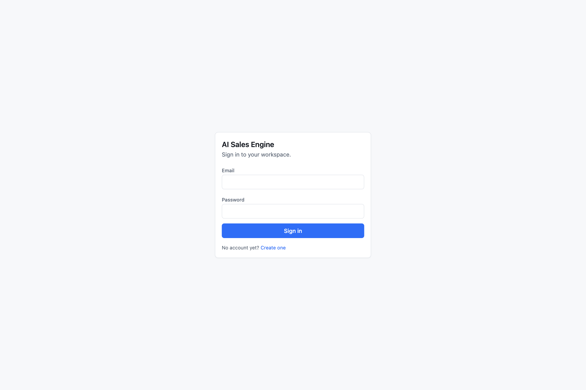
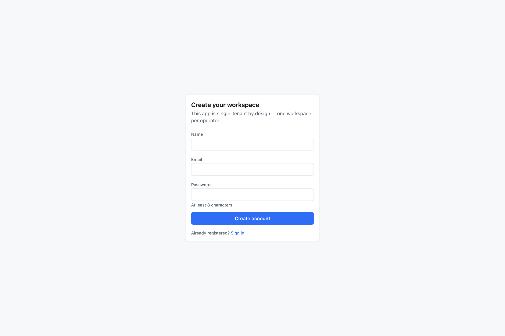

# Getting started

## Prerequisites

- **Node.js 20 or newer** (developed on Node 24)
- **Docker** with Compose, for PostgreSQL and Redis. You can point `DATABASE_URL` / `REDIS_URL` at existing servers instead.
- No API keys are needed to run the app. Mock providers cover AI, email, and search.

## 1. Install

```bash
git clone https://github.com/Abduboriy1/outbound-os.git
cd outbound-os
npm install
```

`npm install` runs a `postinstall` step that generates the Prisma client into `server/generated/prisma` and prepares Nuxt types. If you ever see "Cannot find module '~~/server/generated/prisma'", rerun `npm install`.

## 2. Environment

```bash
cp .env.example .env
```

The defaults are enough for local development:

- `DATABASE_URL` and `REDIS_URL` match `docker-compose.yml`.
- `AI_PROVIDER`, `EMAIL_PROVIDER`, and `SEARCH_PROVIDER` are all `mock`.
- `AUTH_SECRET` and `ENCRYPTION_KEY` are placeholder dev values. **Generate real ones before any deployment:**

```bash
openssl rand -base64 32   # AUTH_SECRET
openssl rand -hex 32      # ENCRYPTION_KEY (must be 64 hex chars)
```

Every variable is documented in [Configuration](configuration.md).

## 3. Database

```bash
npm run db:up        # starts postgres (host port 55432) and redis (host port 56379)
npm run db:migrate   # applies prisma/migrations
npm run db:seed      # demo workspace
```

The seed creates:

- A user: **`demo@example.com` / `demo12345`** ("Demo Operator")
- Compliance settings with a sample sender identity and a daily send limit of 25
- One default ICP, "Logistics Automation ICP"
- Six sample companies, each with a contact, a lead at a different stage, a score, and a task
- Seven weekly goals and one case study

The seed is idempotent. Run it again and it skips if the demo user exists. To start over: `npm run db:reset` (wipes the database, migrates, reseeds).

## 4. Run

```bash
npm run dev
```

Open http://localhost:3000 and sign in with the demo credentials. You will be redirected to `/login` for any page until you do.



New accounts are created at `/register` (name, email, password of at least 8 characters). The app is designed as one workspace per operator.



### The worker

Research, rescoring, and stale-lead sweeps are queued jobs. Start a worker in a second terminal to process them in the background:

```bash
npm run worker
```

Without a worker, and with Redis reachable, jobs sit in the queue and research reports stay `PENDING`. The Research Queue page shows a red **no worker** badge when this happens. If Redis is *not* reachable at all, the app runs jobs inline inside the request instead — slower, but everything still works. See [Architecture › Queue and worker](architecture.md#queue-and-worker).

### One command for everything

```bash
npm run dev:all
```

Starts Docker (waits for health checks), runs `prisma migrate deploy`, then runs the dev server and the worker together with coloured output.

## 5. First things to try

1. **Dashboard** — the Today queue tells you what is waiting. Press **Generate** under *Today's plan* to see the sales-coach agent produce a prioritised plan.
2. **Leads → open any lead → Research tab → Run research.** Watch the activity timeline fill in. On mock providers the sources are labelled `[SAMPLE DATA]`.
3. **Outreach → Approval Queue.** Five drafts are waiting. Open one, toggle **Edit**, then **Approve & Send**. On the mock email provider nothing leaves your machine; the send is recorded and a synthetic reply will appear next time you press **Check for replies** in the Inbox.
4. **Import → Find leads with AI.** On mock providers it returns fictional `.example` companies so you can see the verification and import flow.
5. **Research → ICPs → New ICP → Start** the interview and let the AI draft a profile from your answers.

## 6. Connecting real providers

Each is independent. Set the variable, restart the dev server, and the **Settings → Integrations** page shows what is live.

| Want | Set | Details |
| --- | --- | --- |
| Real AI | `AI_PROVIDER=anthropic` + `ANTHROPIC_API_KEY`, or `AI_PROVIDER=gemini` + `GEMINI_API_KEY` | [Configuration › AI provider](configuration.md#ai-provider) |
| Real web pages in research | `SEARCH_PROVIDER=http` | Fetches the company's own site. Add `SEARCH_API_KEY` (Brave or Serper) to also search the web. |
| Real email | `EMAIL_PROVIDER=gmail` + Google OAuth client | [Configuration › Gmail](configuration.md#gmail-oauth-setup), then connect from Settings → Integrations |

## 7. Tests and checks

```bash
npm test              # vitest, no database or redis needed
npm run lint
npm run typecheck
```

## 8. Production build

```bash
npm run build         # -> .output/
npm run db:deploy     # prisma migrate deploy against the production DATABASE_URL
npm start             # node .output/server/index.mjs, listens on $PORT (default 3000)
```

Run `npm run worker` as a second long-lived process. Set `NODE_ENV=production`: this marks the session cookie `secure`, so **the app must be served over HTTPS** or login will fail. Set `APP_URL` to your public origin (it is used for the Gmail OAuth redirect) and change `INTAKE_API_TOKEN` from its default.

Required in production: `DATABASE_URL`, `AUTH_SECRET`, `ENCRYPTION_KEY`, `APP_URL`, `INTAKE_API_TOKEN`. Everything else has a working default.
