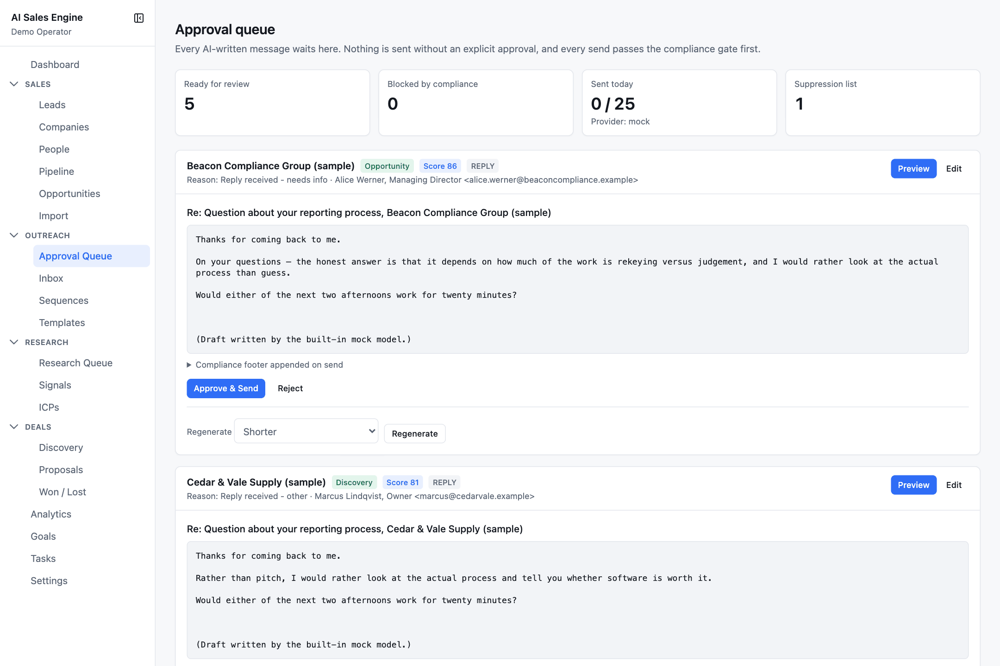
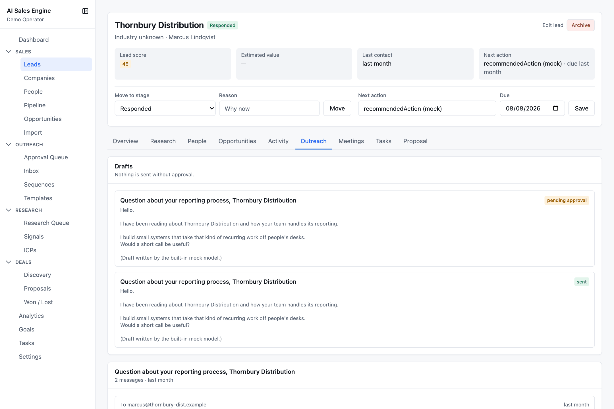
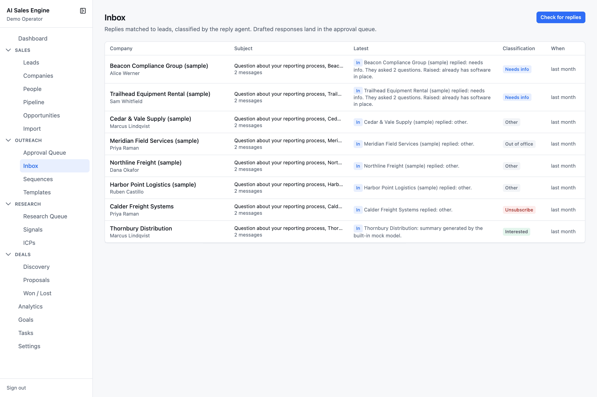
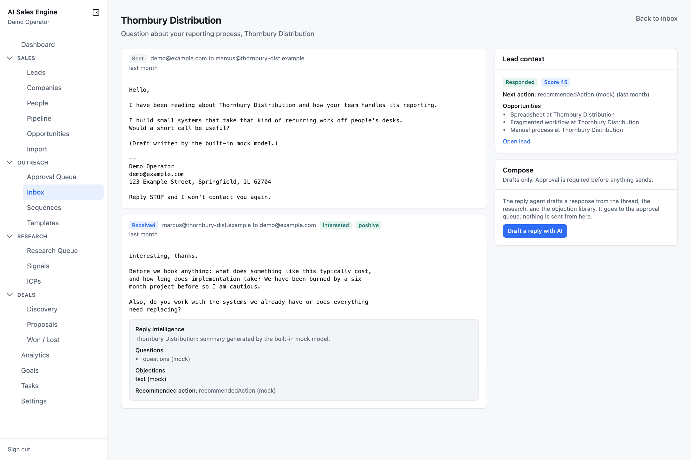
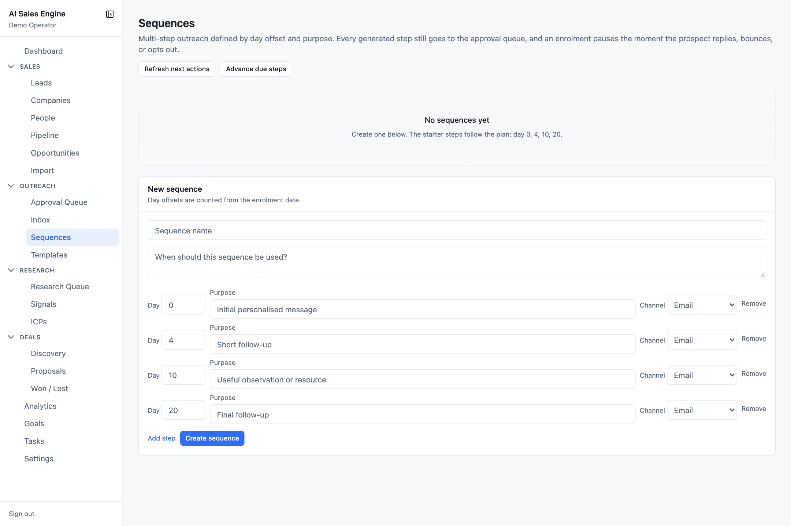
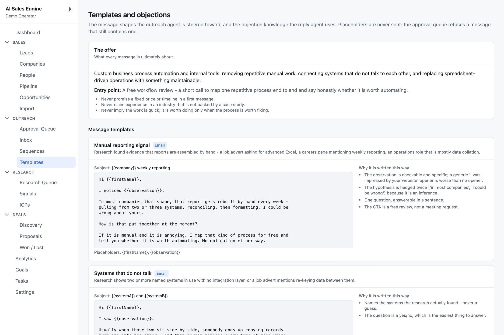

# Outreach

The **Outreach** section is the only place messages are written, approved, sent, and answered. Its governing rule: **every AI-written message waits in the approval queue, and nothing is sent without an explicit approval.**

- [Approval queue](#approval-queue)
- [How drafts are written](#how-drafts-are-written)
- [Inbox](#inbox)
- [Sequences](#sequences)
- [Templates and objections](#templates-and-objections)
- [Compliance gate](#compliance-gate)

---

## Approval queue

`/outreach/approvals`

Stat cards: **Ready for review**, **Blocked by compliance**, **Sent today** (against the daily limit, with the active provider), **Suppression list** size. If sender identity is incomplete a red banner explains that sending is disabled until compliance settings are configured.

### The approval card

Header: company, stage badge, **Score N**, variant badge (Email / Short version / LinkedIn / Follow-up / Referral introduction request / Reply), and *Reason: …* — why this lead surfaced now — plus the contact.

- **Preview** shows subject, body, and a collapsible *Compliance footer appended on send* with the exact footer.
- **Edit** swaps in a subject field and a body textarea. Edits are sent with the approval.
- Red **Compliance blocks this send** lists every block (see [Compliance gate](#compliance-gate)). Amber **Unfilled placeholders** lists any `{{merge}}` fields left in the text. Either one disables the approve button.
- **Approve & Send** (email) or **Approve for manual send** (LinkedIn — creates a task to send it by hand, nothing is sent).
- **Reject** asks *"Why is this wrong?"*; a reason is required so the agent can learn from it.
- **Regenerate** with a hint: Shorter · Friendlier · More Direct · Less Salesy · Focus on ROI · Focus on Automation · Ask a Different Question. The old draft is kept as *Previous draft* for the audit trail.

### What Approve & Send does

1. Refuses if the draft was already sent or rejected, is not an email, or the contact has no address.
2. Runs the compliance gate.
3. Re-scans for placeholders. Any left → refused: *"The message still contains unfilled placeholders"*.
4. Appends the compliance footer (idempotent, never stacks).
5. Writes **approved** and an audit row *before* calling the provider.
6. Sends. On failure the draft becomes **FAILED** and is audited; on success the message is stored on the thread.
7. Advances a pre-contact lead to **Contacted**, updates last-contact dates, logs *outreach sent*.
8. Schedules a follow-up task on the no-reply ladder: 4, 6, 10, then 20 days.

### Ready for outreach

Beneath the queue: qualified leads with a contact and no pending draft, sorted by score. Pick a variant and press **Draft** to generate one into the queue.

---

## How drafts are written

The outreach agent is given: the lead, company, and contact; your name and tone; the top three opportunities; the newest research report with its claims (FACTs and INFERENCEs kept separate); up to three matching case studies (exact industry match, keyword overlap); and a summary of any previous conversation. Prospect-authored text goes in as an untrusted document.

The message must follow four beats: **observation → problem hypothesis → simple question → low-friction call to action.** The agent may not invent a metric, customer, headcount, tool, or quote; may not state an inference as fact; and must avoid flattery, "hope this finds you well", fake personalisation, manufactured urgency, merge fields, deceptive subjects, or implied prior conversation. It writes no signature or unsubscribe line — the app appends the compliance footer itself.

| Variant | Channel | Subject | Max words |
| --- | --- | --- | --- |
| Email | email | yes | 140 |
| Short version | email | yes | 70 |
| LinkedIn / DM | LinkedIn | no | 60 |
| Follow-up | email | yes | 80 |
| Referral introduction request | email | yes | 110 |

The lead's **Outreach** tab shows every draft and thread for that lead, read-only:

Every draft is stored with its structure, the claims it used, its assumptions, its rationale, and its confidence, and logs an *outreach drafted* activity. Three things create drafts: a person pressing **Draft** (queue) or **Draft a reply with AI** (inbox), a sequence step coming due, and a genuine reply arriving.

---

## Inbox

`/outreach/inbox` — replies matched to leads and classified by the reply agent.

Press **Check for replies** to poll the email provider. The result line reads like *"Fetched 6, ingested 5, 1 bounce(s), 1 opt-out(s), 2 draft(s) awaiting approval."* There is no scheduled poll; this button (or an external scheduler hitting the same endpoint) is how mail comes in.

Columns: Company (contact beneath) · Subject with message count · Latest (In / Out badge + AI summary) · Classification · When.

Intents: **Interested** · **Needs info** · **Question** · **Not interested** · **Not now** · **Referred on** · **Out of office** · **Auto reply** · **Unsubscribe** · **Other**, plus a **Bounced** badge.

### What ingest does to each message

1. De-duplicates on the provider message id.
2. **Bounce detection** — daemon senders, bounce subjects, RFC 3463 status codes. A report with no recognisable status is treated as permanent.
3. **Opt-out detection** — *unsubscribe*, *remove me*, *do not contact*, *opt out*, *stop emailing*, a bare *STOP* line, and similar. Quoted text is stripped first so your own footer quoted back does not register as an opt-out.
4. **Auto-reply detection** — out-of-office phrasing.
5. **Thread matching** by provider thread id, then by contact email, then by known contact.
6. **Mechanical handling, before any AI runs**: a bounce suppresses the address, marks the outbound message bounced, pauses enrolments, and voids pending drafts. An opt-out suppresses the address, pauses enrolments, moves the lead to **Do not contact**, and rejects its pending drafts. A genuine reply pauses enrolments and moves the lead to **Responded**.
7. The **reply agent** reads the thread (the prospect's message only as an untrusted document) and returns intent, sentiment, summary, the questions asked, objections mapped to the playbook, a recommended action, and optionally a drafted reply. **Mechanical detections win** — if the text says unsubscribe and the model says interested, the address is suppressed and no reply is drafted.
8. A drafted reply lands in the approval queue as variant **Reply**, subject *Re: …*.
9. A follow-up task is scheduled by intent: Interested / Needs info 2 days, Question 1, Referred on 3, Other 4, Auto reply 5, Out of office 7, Not now 90, Not interested / Unsubscribe never.

### Thread view

Each message shows sender / recipient, intent and sentiment badges, the full body, and — for analysed replies — a **Reply intelligence** panel: summary, **Questions**, **Objections** (with *Ask first:* from the objection library), and **Recommended action**. The right rail shows lead context and a **Compose** card whose only button is **Draft a reply with AI** — it drafts into the approval queue; nothing is sent from here.

---

## Sequences

`/outreach/sequences` — multi-step outreach defined by day offset and purpose.

- **New sequence** — name, description, and steps. Four starter steps are pre-filled: day 0 *Initial personalised message*, day 4 *Short follow-up*, day 10 *Useful observation or resource*, day 20 *Final follow-up*. Each step has a day (0–365, counted from enrolment), a purpose (what the agent is told the step is for), and a channel (Email or LinkedIn).
- **Enrol a lead** — pick a sequence and a lead. Leads marked do-not-contact, not a fit, won, lost, or customer are never listed, and a contact is required. Re-enrolling restarts the sequence from day 0.
- **Advance due steps** — walks every active enrolment, generates a draft for each step that is due (step 0 → Email variant, later steps → Follow-up, LinkedIn channel → LinkedIn DM), and moves the enrolment forward. Result line: *"2 draft(s) queued for approval, 1 enrolment(s) paused, 0 completed."*
- **Refresh next actions** — gives every active lead without a next action a task *"Decide the next step for <Company>"* and flags stale leads. Creates tasks only; contacts nobody.
- Per enrolment: status (Active / Paused / Completed / Stopped), *step N / total*, next run, and a **Pause** button.

An enrolment pauses automatically, in this priority, when: paused by hand · the prospect opted out · the address is suppressed · a message bounced · the lead is in an uncontactable stage · the prospect replied · the lead has no contact email. The reason is shown under the status. There is no resume; re-enrol to start again.

Every step a sequence produces is a draft in the approval queue. A sequence can never put a message in front of a prospect on its own.

---

## Templates and objections

`/outreach/templates` — read-only reference material the agents are steered by.

- **The offer** — what you sell, the entry point (a free workflow review), and the constraints the agent must respect (never promise a fixed price or timeline in a first message, …).
- **Message templates** — six shapes: *Manual reporting signal*, *Systems that do not talk*, *Short version*, *LinkedIn message*, *Follow-up after no reply*, *Referral introduction request*. Each shows its subject, body, placeholders, and *why it is written this way*.
- **Objection library** — seven objections (too expensive, need to think, already have software, can build it internally, not a priority, send me information, no budget). For each: *usually means*, *ask first*, *how to respond*, *never*, and *when the objection is right*. The stated objective is to understand the objection and work out whether the project genuinely makes sense, not to overcome resistance.

Placeholders like `{{firstName}}` are never sent. They are flagged on the approval card and refused by the server.

---

## Compliance gate

Every send passes through the same check, which returns **all** applicable blocks so the approval card can explain the whole picture:

| Block | Message |
| --- | --- |
| Invalid address | *"<value>" is not a valid email address.* |
| Suppressed | *This address has opted out of further contact.* / *Mail to this address has bounced.* / *This address filed a spam complaint.* / *…marked do-not-contact.* / *…suppressed manually.* |
| Uncontactable stage | *The lead is in stage DO_NOT_CONTACT; contacting it is not permitted.* |
| Bounced | *A previous message to this address bounced.* |
| Sender identity missing | *Configure a sender name and sender email in compliance settings before sending.* |
| Physical address missing | *Configure a physical mailing address in compliance settings before sending.* |
| Daily limit | *Daily send limit of 50 reached (50 sent today).* — counted since 00:00 UTC |

The **compliance footer** appended to every outbound body: a `-- ` rule, sender name, sender email, postal address on one line, then the opt-out text (default *"Reply STOP and I won't contact you again."*). The preview on the card and the footer actually sent are rendered by the same server function so they cannot differ.

Sender identity, opt-out text, daily limit, and the suppression list are managed under [Settings → Compliance](settings.md#compliance).
