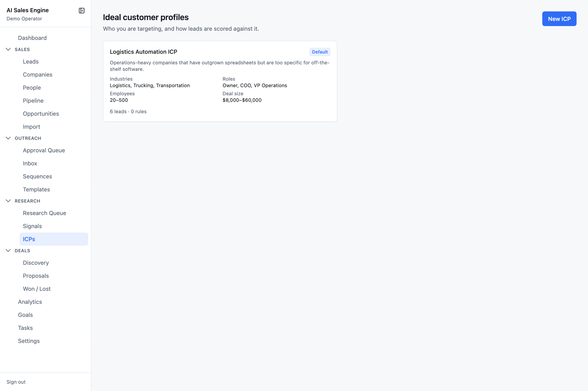
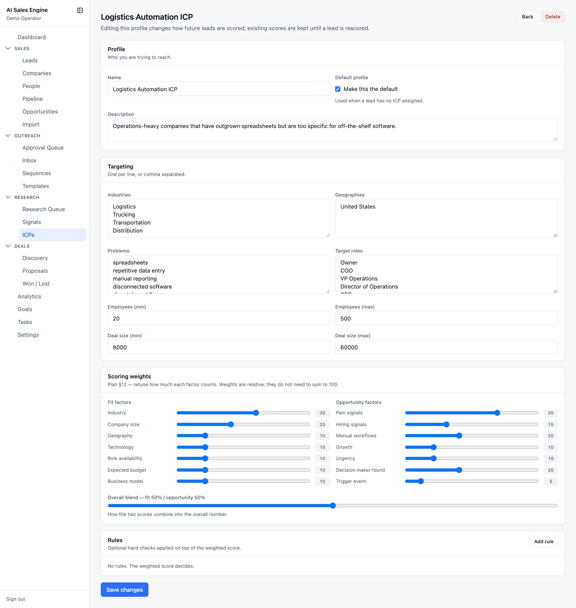
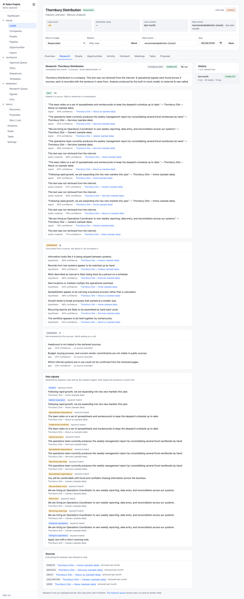
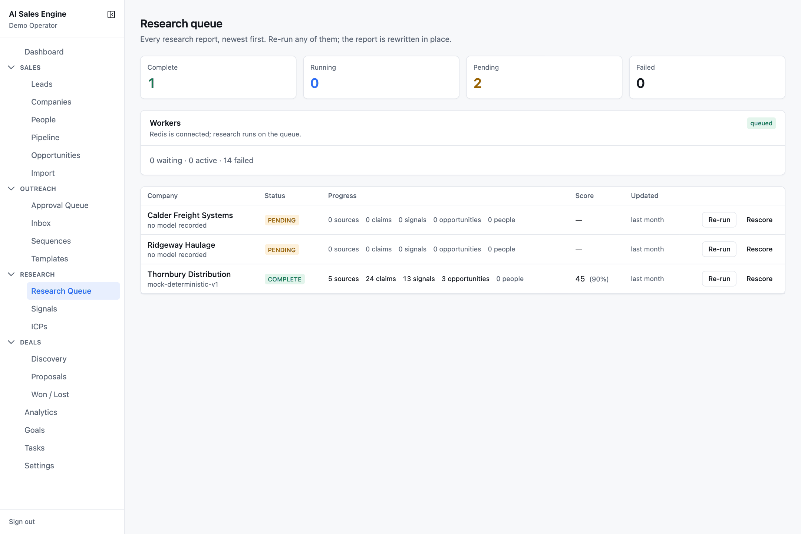
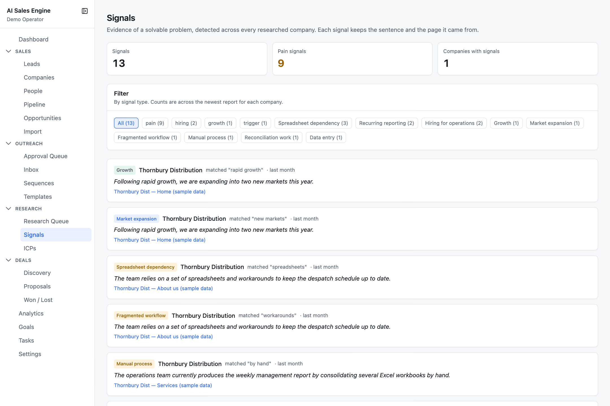

# Research

The **Research** section is where leads become evidence: ideal customer profiles define who you want, the research agent builds a sourced report on each company, and signals surface the problems worth talking about.

- [ICPs](#icps)
- [The research report](#the-research-report)
- [Research queue](#research-queue)
- [Signals](#signals)
- [AI lead finder](#ai-lead-finder)

---

## ICPs

`/research/icps` — your ideal customer profiles. One is the **default**, used whenever a lead has no ICP assigned.

Each card shows industries, target roles, employee range, deal size, and *N leads · N rules*. **Make default** promotes a profile (and demotes the previous default).

### Creating an ICP with the AI interview

`/research/icps/new`

1. Press **Start** on the *Interview me* card. Seven questions appear; answer any you can (at least one):
   - What do you build for clients, in one or two sentences?
   - Which past clients were the best fit, and what did they have in common?
   - What operational problems do you solve most often?
   - Who signs off on this work, and who else is involved?
   - Where are the clients you can realistically serve?
   - What does a typical engagement cost, from smallest to largest?
   - What makes a company a bad fit, however interested they seem?
2. Press **Draft an ICP**. The qualification agent returns a draft plus an **AI rationale**, a list of what the answers did not cover, and **suggested disqualifiers**.
3. The form below is pre-filled. Nothing is saved yet.
4. Edit anything, then press **Create ICP**.

Your answers are treated as first-party context (they are your own words about your own business), not as an untrusted document.

### The editor

Four cards:

- **Profile** — name, description, and *Make this the default*.
- **Targeting** — industries, geographies, problems, target roles (one per line or comma-separated, up to 50 each), employee min/max, deal size min/max.
- **Scoring weights** — a 0–50 slider per fit factor and per opportunity factor, plus the **Overall blend** slider. Weights are relative; they do not need to sum to 100. See [Core concepts › Lead scoring](concepts.md#lead-scoring).
- **Rules** — optional hard checks (field / operator / value / weight). See [Known limitations](known-limitations.md): rules are stored and displayed but not yet evaluated by the scorer.

Editing an ICP changes how *future* scores are computed. Existing scores are kept until a lead is rescored (from the Research queue or the next research run).

---

## The research report

Open any lead → **Research** tab. Press **Run research** to start; the report builds in the background and the page polls every few seconds.

### What a run does

1. Marks the lead **Researching**.
2. **Gathers sources** — the company's own site (`/`, `/about`, `/services`, `/careers`, `/news`, `/team`, `/contact`, …) and follows its navigation for team / leadership / contact pages. Up to 14 sources.
3. **Plans searches** like a human researcher would (each query is logged with its one-sentence reason), runs them through the search provider, and fetches the best results. Skipped, with a log line, when no `SEARCH_API_KEY` is configured.
4. **Analyses** the pages with the research agent, steered by the lead's ICP. Every page travels as an untrusted document; instruction-shaped text is stripped and reported.
5. **Persists claims** (FACT / INFERENCE / UNKNOWN), each linked to a stored source.
6. **Detects signals** from keyword rules, merged with what the agent proposed.
7. **Discovers people** — decision makers from the agent plus a deterministic email / phone harvest — and creates or enriches contacts. The company's phone number is saved if it had none.
8. **Scores the lead** from the new evidence.
9. **Generates opportunities** from the claims and signals.
10. Marks the report **COMPLETE** and logs an activity. Failures land in **FAILED** with the error on the row.

### Reading the report

- **Header** — company, *Completed 3 hours ago · 7 sources · <model>*, a **Confidence N%** badge, and **Re-run**.
- **Activity** — two live timelines: *Company research* (pages fetched, analysis, signals, opportunities) and *People research* (names, emails, contacts added).
- **People added to this lead** — new contacts, enriched contacts, harvested phone numbers, each with a source link.
- **FACT / INFERENCE / UNKNOWN** cards, each claim with category, confidence, and source link (or *no source recorded*).
- **Pain signals** — up to 20, each with the evidence sentence in italics, the provenance (*keyword match* or *agent*), and the source.
- **Sources** — everything the analysis was allowed to read, with kind (website, about, careers, news, team, …) and retrieval time.
- **History** rail — every run for this lead; click one to view it.

On mock providers every source is labelled `[SAMPLE DATA]` and the model shows as `mock-deterministic-v1`.

---

## Research queue

`/research/queue` — every research report, ordered so the things needing attention sit at the top: FAILED → RUNNING → PENDING → COMPLETE, newest first within each group.

- Stat cards: **Complete**, **Running**, **Pending** (amber when non-zero), **Failed** (red when non-zero).
- **Workers** card: `queued` (Redis connected, research runs on the queue), `inline` (Redis unreachable, jobs run inside the request), or `no worker` (jobs are waiting and nothing consumes them — start `npm run worker`).
- Columns: Company (model used beneath, errors in red, warnings in amber), Status with tooltip, Progress (sources · claims · signals · opportunities · people), Score (with report confidence), Updated.
- **Re-run** rewrites the report in place — existing claims and sources are deleted first so evidence never doubles. Blocked while a run is in progress.
- **Rescore** recomputes the score from existing evidence without fetching anything. Use it after changing an ICP's weights.

Jobs retry three times with exponential backoff. The queue can only re-run existing reports; a *first* run is started from the lead's Research tab.

---

## Signals

`/research/signals` — every detected signal across all researched companies, with the sentence and page it came from.

Counts come from the **newest complete report per company** so evidence is never double-counted. Filter chips: **All**, the four families (**pain**, **hiring**, **growth**, **trigger**), and one chip per signal type sorted by count. Filters are in the URL.

Each card: the signal label, the company (linked), how it was found (*matched "reconcil"* or *detected by the agent*), when, the evidence sentence in italics, and the source link.

---

## AI lead finder

Lives on the **Import** page. It searches the web against an ICP and offers only companies it could verify against a page it actually read. Step-by-step usage is in [Sales › Import › Find leads with AI](sales.md#find-leads-with-ai).

Two strategies, chosen automatically:

| Strategy | When | How |
| --- | --- | --- |
| **search-api** | `SEARCH_PROVIDER=http` and `SEARCH_API_KEY` set | The model plans up to 6 queries, Brave / Serper answers them, and *this app* fetches and reads each result page (max 12). Preferred, because citations are pages the app retrieved. |
| **grounded** | otherwise | The AI provider runs its own searches (Gemini's Google Search grounding; mock fakes it). Anthropic cannot do this and reports *"lead discovery is unavailable"*. |

Then a verification gate: a candidate is kept only if its domain was among the retrieved pages or if the domain answers a live fetch. Finally it is de-duplicated against your existing companies and contacts. Imported leads record *"Found by AI search (<provider>) via <host>"* as their source detail.
