# Sales

The **Sales** section is your book of business: leads, the companies and people behind them, a kanban board, opportunities, and the import tools.

- [Leads](#leads)
- [Lead workspace](#lead-workspace)
- [Companies](#companies)
- [People](#people)
- [Pipeline board](#pipeline-board)
- [Opportunities](#opportunities)
- [Import](#import)

---

## Leads

`/leads` — every lead as a filterable, sortable table.

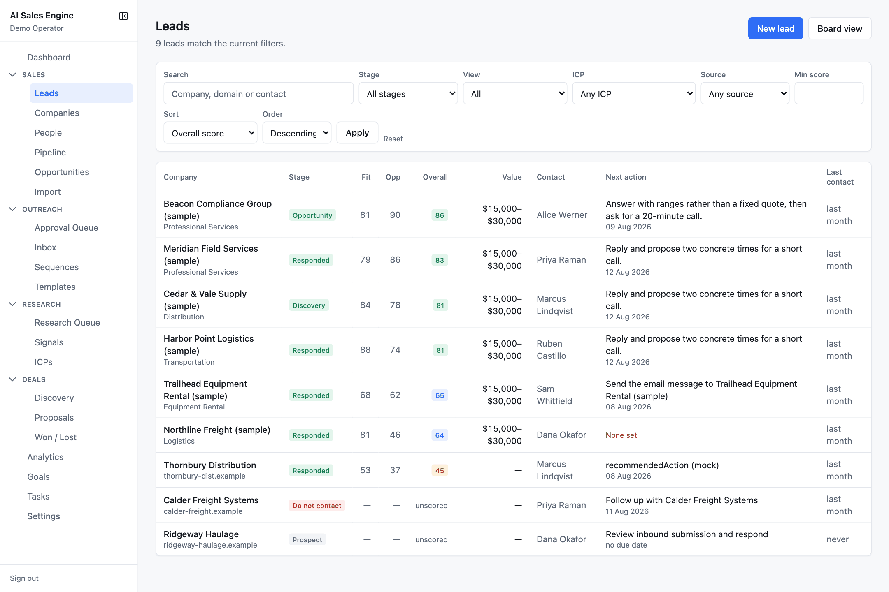

**Filters** (all stored in the URL, so a view is bookmarkable and the back button works):

| Filter | Options |
| --- | --- |
| Search | company name, domain, contact name or email |
| Stage | any of the 19 stages |
| View | All · Active pipeline · Overdue next action · No next action · Not yet scored |
| ICP | any profile |
| Source | manual, csv, website form, referral, search provider, directory, job posting, conference, existing contact |
| Min score | 0–100 |
| Sort / Order | Overall score, Estimated value, Next action due, Recently updated, Recently added, Company name, Stage |

**Columns:** Company (industry or domain beneath) · Stage badge · Fit · Opp · Overall (score badge) · Value · Contact · Next action with due date (amber *None set* when missing) · Last contact.

Buttons: **New lead** and **Board view** (the pipeline kanban).

### New lead

`/leads/new` offers two forms side by side:

- **From an existing company** — pick the company and optional primary contact, set stage (default Prospect), ICP, source, estimated value range, and next action.
- **Company, contact and lead** — one form that creates all three for a prospect you just found. Only the company name is required. The contact is created only if a first name is given.

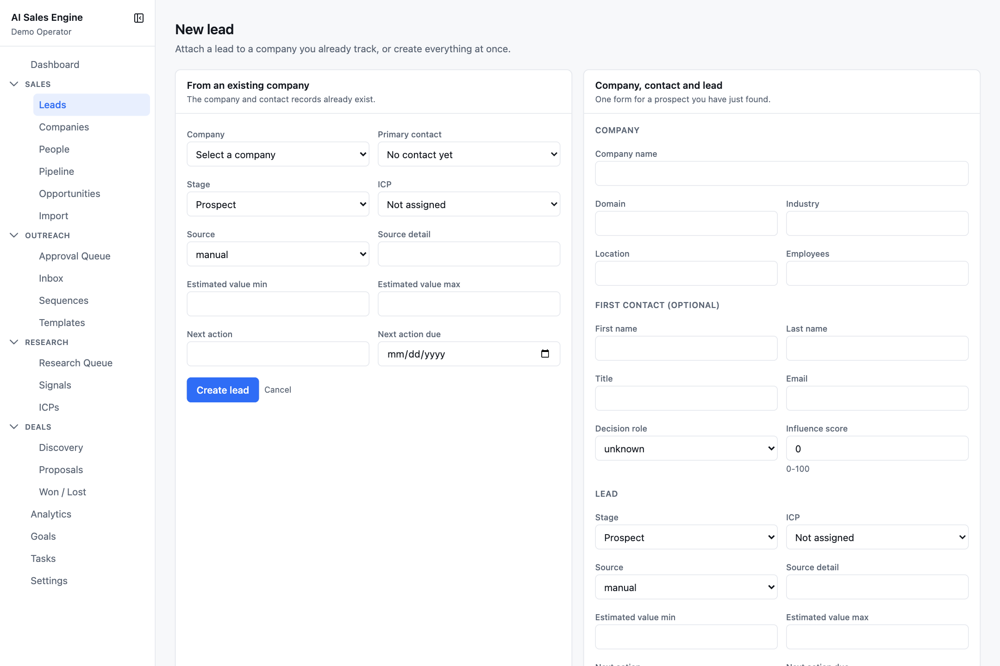

Both end on the new lead's workspace. Arriving from a company page pre-selects that company.

---

## Lead workspace

`/leads/:id` — everything about one lead, with a header that stays put and nine tabs beneath.

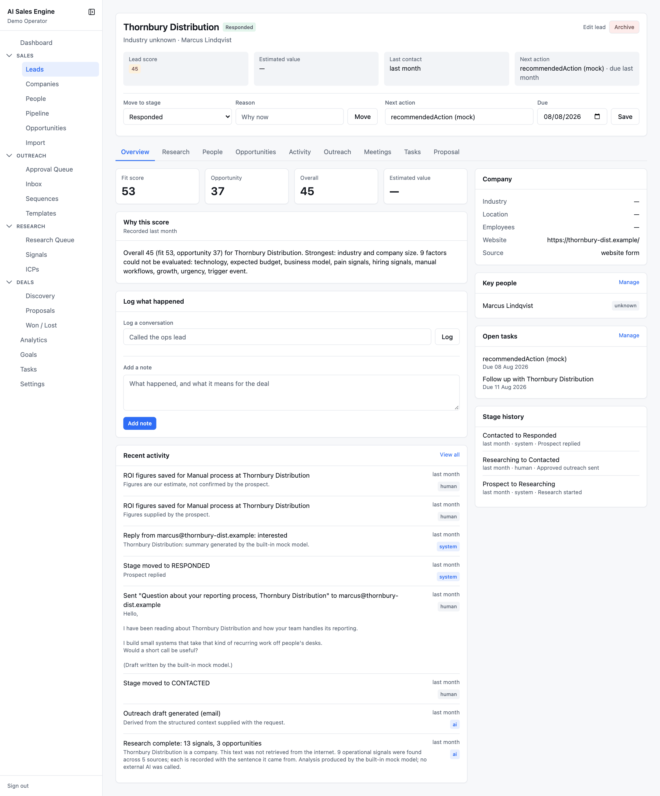

### Header

- Company name (links to the company), stage badge, ICP badge, industry · location · contact.
- **Edit lead** and **Archive** (asks for confirmation, then soft-deletes and returns to the list).
- Four tiles: Lead score, Estimated value, Last contact, Next action.
- **Move to stage** — choose a stage, give a reason (required for Lost and Do not contact), press **Move**. Every move is recorded with who, when, and why.
- **Next action** — free text plus a due date. Saving logs an activity; clearing the text clears the date.

### Tabs

| Tab | What is there |
| --- | --- |
| **Overview** | Fit / Opportunity / Overall / Estimated value tiles. **Why this score** — the scoring engine's own sentence, e.g. *"Overall 45 (fit 53, opportunity 37). Strongest: industry and company size. 9 factors could not be evaluated: …"*. **Log what happened**: *Log a conversation* (one line, updates last-contact) and *Add a note*. Recent activity (last 8). Right rail: company facts, key people, open tasks, stage history. |
| **Research** | The research report and run history. See [Research › Research report](research.md#the-research-report). |
| **People** | Everyone at this company ordered by influence, with decision role, relationship status, last interaction. The primary contact is badged. **Add contact** pre-fills the company. |
| **Opportunities** | Read-only cards from the opportunity agent: problem, solution, benefit, confidence, ROI inputs. |
| **Activity** | The complete event log, newest first, plus the complete stage history with reasons. An *Add a note* form at the top. |
| **Outreach** | Read-only: every draft with its status, and every email thread with messages and reply intents. |
| **Meetings** | Read-only: scheduled and past meetings with AI summaries and notes. |
| **Tasks** | Add a task (title + due date). Tasks grouped into Overdue / Today / Upcoming / No due date with **Done**, **Cancel**, **Reopen**. AI-created tasks are badged. |
| **Proposal** | Read-only: proposals and their versions with investment ranges. |

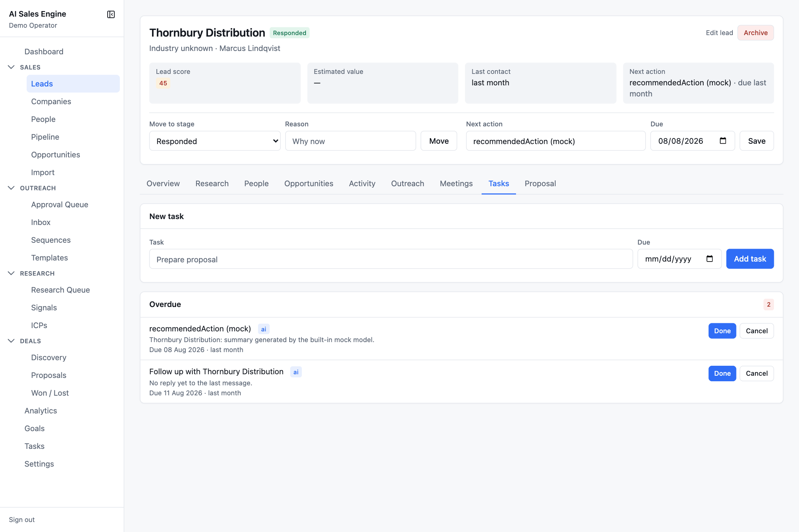

Some tasks appear on their own: the stale-lead sweep creates *"Lead has gone quiet: <Company>"* after 14 days without activity in an active stage, and the follow-up sweep creates *"Decide the next step for <Company>"* for active leads with no next action.

---

## Companies

`/companies` — every organisation, with people and lead counts.

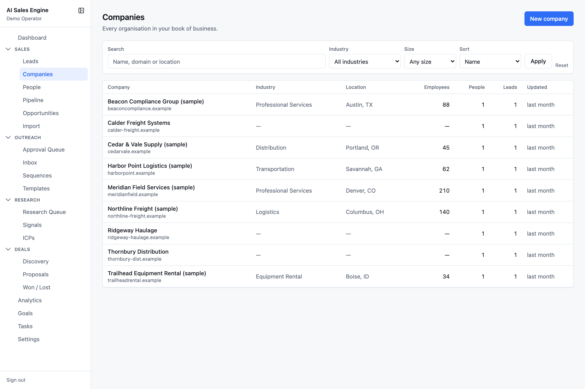

Filters: search (name, domain, location), industry, size band, sort. **New company** opens a form with name (required), domain, website, industry, location, employees, size label, LinkedIn, phone, description. Creating a company whose domain already exists is refused with *"A company with that domain already exists"*.

The company page shows its leads, its people, details, and recent activity, with buttons for **New lead**, **New contact**, **Edit**, and **Delete**. Deleting a company archives its leads with it and asks for confirmation.

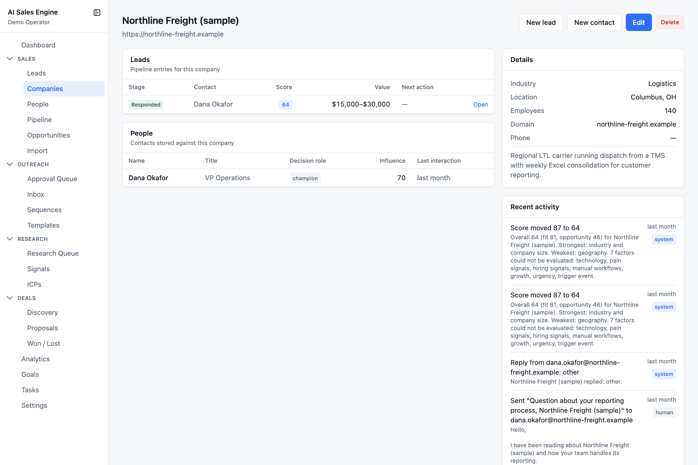

---

## People

`/people` — decision makers and influencers, stored independently of leads.

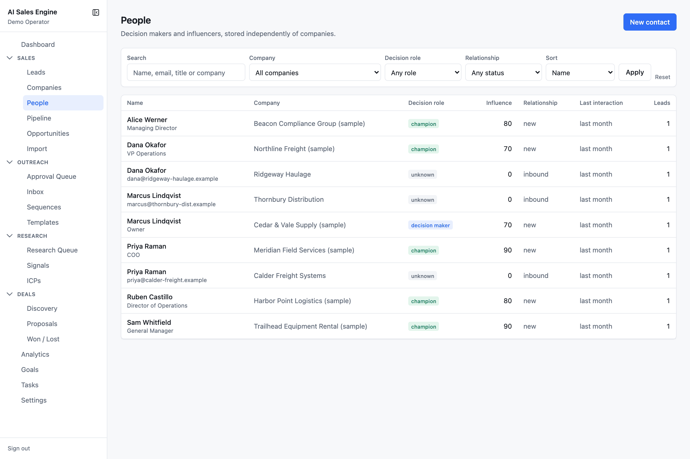

Filters: search, company, decision role (champion, decision maker, technical evaluator, influencer, unknown), relationship status (new, contacted, engaged, meeting held, dormant, closed), sort by name, influence, or last interaction.

A contact has a title, email, phone, profile URL, decision role, influence score (0–100), relationship status, last interaction date, and notes. The contact page lists the leads they are attached to, their activity, and their open tasks.

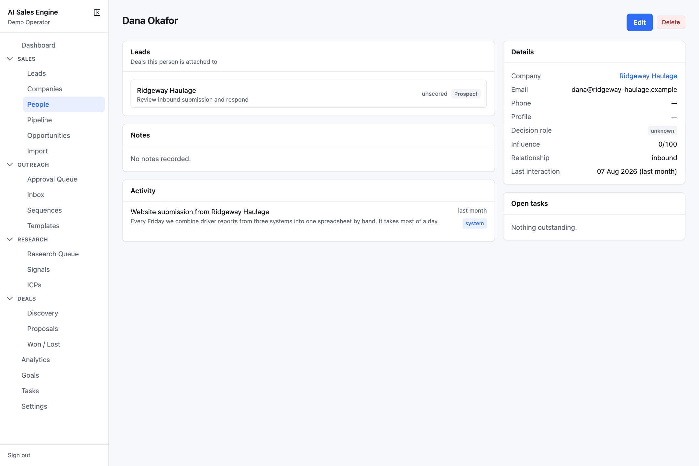

---

## Pipeline board

`/pipeline` — the kanban view of the working pipeline.

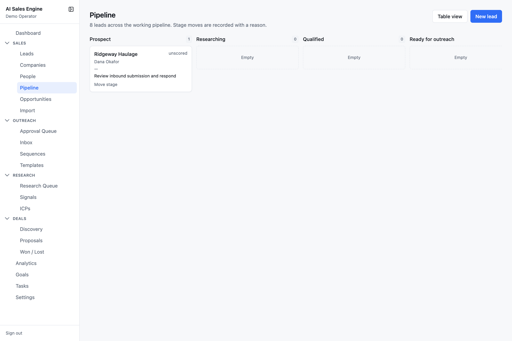

- One column per pipeline stage from **Prospect** to **Customer**, with a count badge. Off-pipeline stages are not columns but remain selectable when moving a card.
- Each card: company, score badge, contact, estimated value, next action with due date (amber *No next action* when missing).
- Expand **Move stage** on a card to choose a stage, give a reason, and **Move**. Refusals (missing reason, do-not-contact) show inline.
- Cards sort by overall score within a column.

---

## Opportunities

`/opportunities` — problems worth solving, generated by the opportunity agent after research.

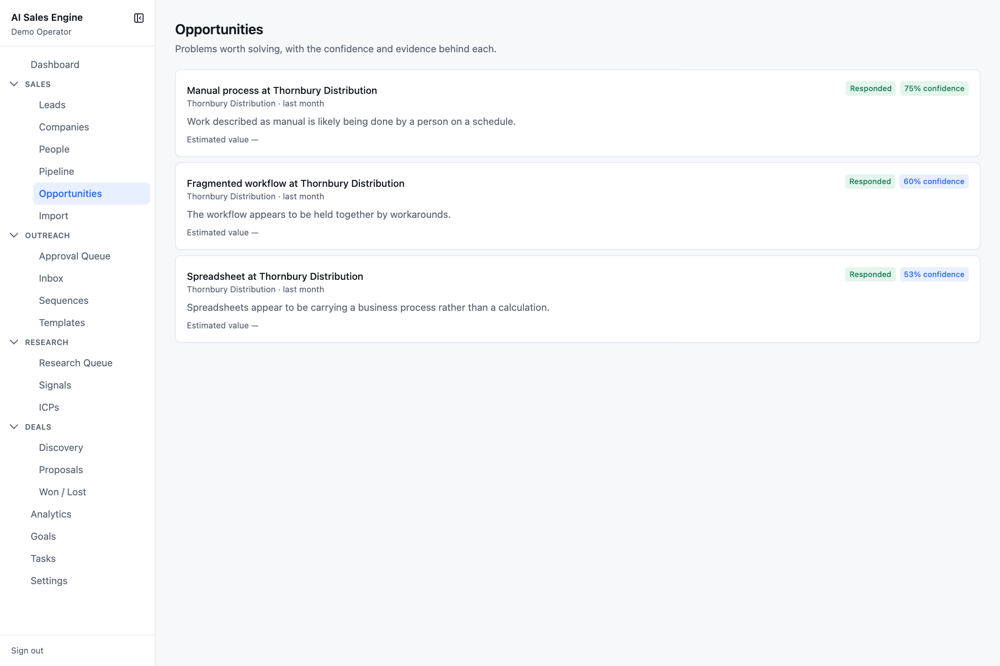

Each card: title, company · industry · age, the problem statement, estimated value, and badges for **ROI confirmed** / **ROI estimate**, the lead's stage, and **N% confidence** (green ≥70, blue ≥40, grey below). Sorted by confidence.

The detail page holds *The case* (problem, recommended solution, business benefit) with status buttons **open / accepted / parked / rejected**, an *Evidence* list, and the [ROI calculator](deals.md#roi-calculator).

---

## Import

`/import` — three ways to add leads. Duplicates are detected by domain and email before anything is written, and every imported lead lands at **Prospect** with next action *"Research this company"*.

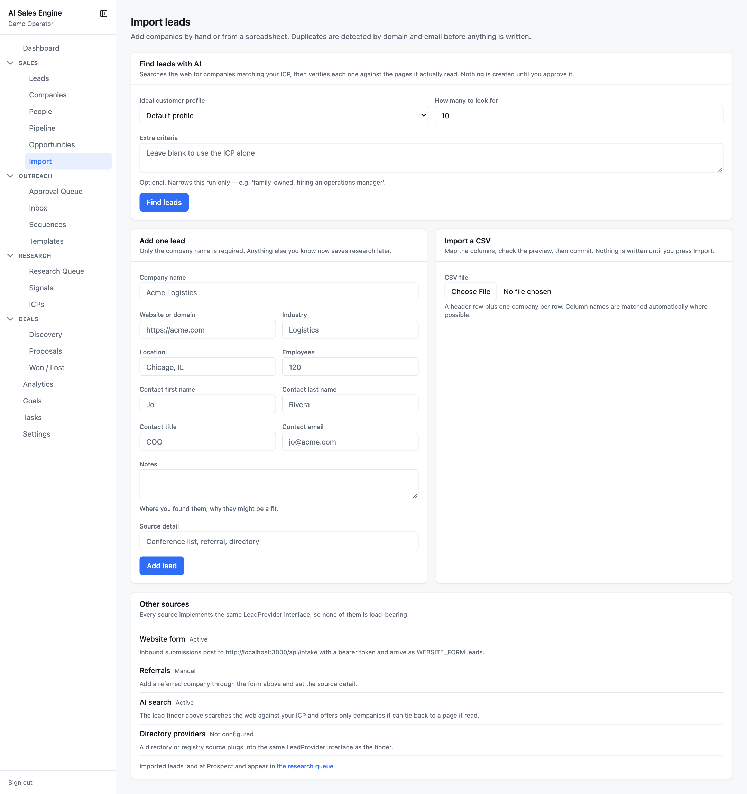

### Find leads with AI

Searches the web for companies matching your ICP, then keeps only the ones it can tie back to a page it actually read.

1. Choose an **Ideal customer profile** (or the default), how many to look for (1–25), and optional **Extra criteria** that narrow this run only (e.g. *"family-owned, hiring an operations manager"*).
2. Press **Find leads**. This runs a live search and can take up to a minute.
3. Review the results table: company, *why it matched* with a source link, and a **Verified** badge — **Domain responded** (the site answered a live fetch) or **Cited by search**. Unverified candidates are listed separately with the reason they were dropped, and companies already in your pipeline are counted but not re-offered.
4. Untick anything you do not want, press **Import N selected**. They are created and queued for research.

How it searches depends on configuration: with `SEARCH_PROVIDER=http` and a `SEARCH_API_KEY`, the model plans up to six queries, the vendor answers them, and the app reads each result page itself. Otherwise it uses the AI provider's own search grounding (Gemini) or the mock. On Anthropic without a search key the finder is unavailable and says so.

### Add one lead

Only the company name is required. Website, industry, location, employees, a contact, notes, and a source detail all save research time later. Values are normalised (domain lower-cased and stripped of protocol, headcount parsed from "50-200" or "~40"), then checked for duplicates; if the company or contact exists you are pointed to the existing lead instead.

### Import a CSV

1. **Upload** — a header row plus one company per row. Parsing happens in your browser.
2. **Map columns** — one dropdown per importable field: Company name (required), Domain, Website, Industry, Location, Employees, Description, Contact first / last name, title, email. Mappings are guessed from header synonyms (`account` → Company name, `headcount` → Employees, `workemail` → Contact email). A column can only be assigned once.
3. **Preview** — badges for *N to create*, *N duplicates skipped*, *N row problems*. Expand the lists to see why a row was skipped (*Company already exists*, *Contact already exists*, *Repeated in this file*, *Skipped: no company name*, *Ignored unreadable email "jo at acme"*). Nothing has been written yet.
4. **Import N leads** — the server re-checks duplicates against live data, then creates company → contact → lead in one transaction, with stage history *Imported via CSV*.

Dedupe rules for all three importers: match on normalised domain first (from the domain column, else the website, else the email's domain), then on normalised contact email. Repeats inside the same file are caught too.

### Other sources

The **Website form** posts to `/api/intake` with a bearer token — see [Configuration › Website intake API](configuration.md#website-intake-api). Referrals are added by hand with a source detail. A directory provider slot exists but is not configured.
