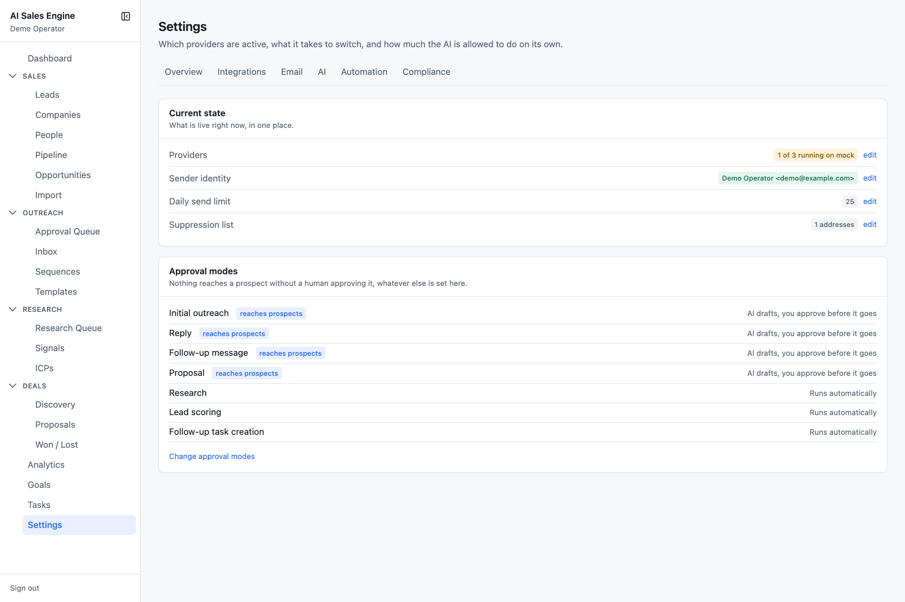
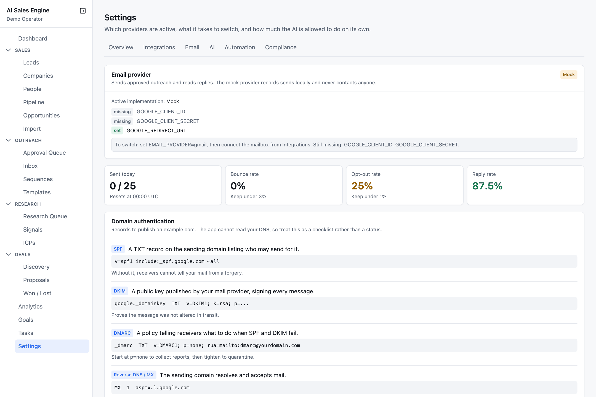
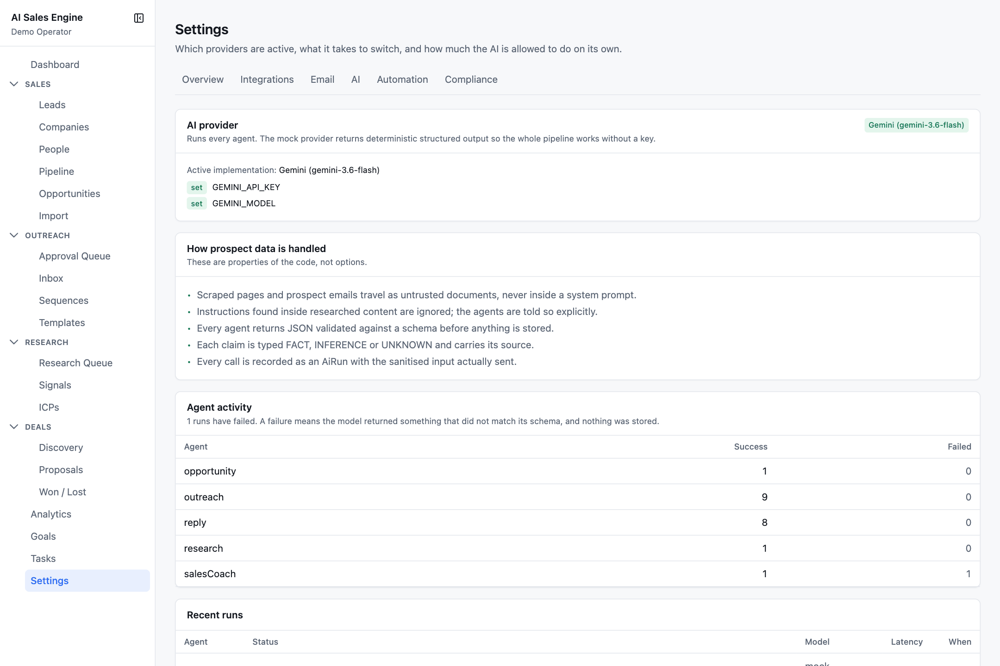
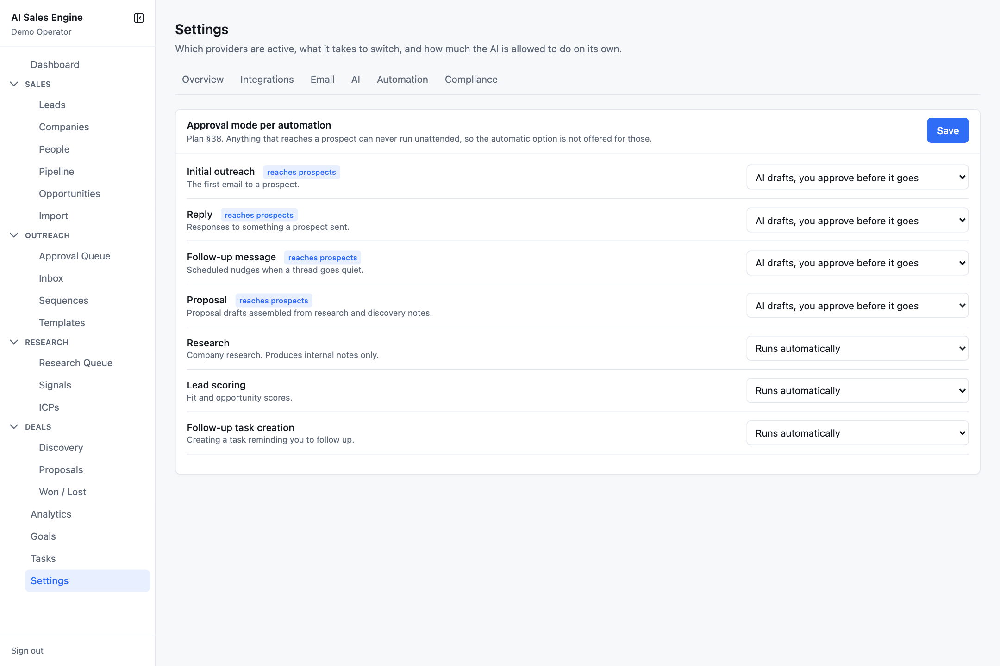
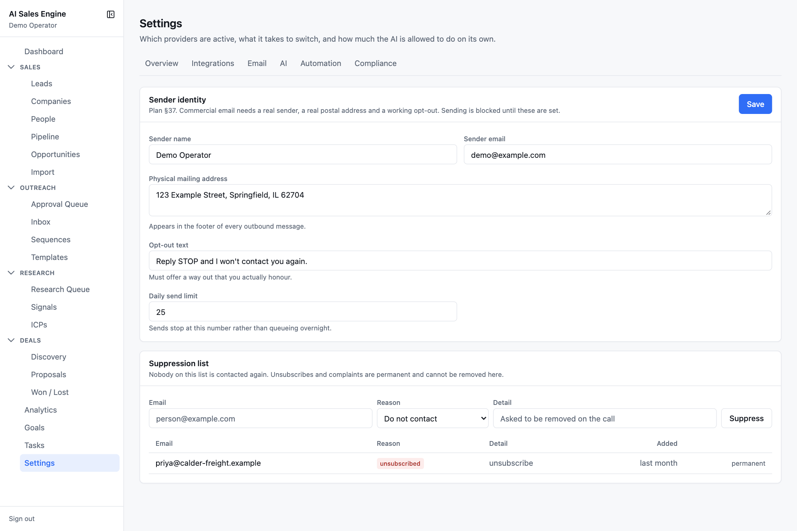

# Settings

`/settings` — *which providers are active, what it takes to switch, and how much the AI is allowed to do on its own.* Six tabs.

- [Overview](#overview)
- [Integrations](#integrations)
- [Email](#email)
- [AI](#ai)
- [Automation](#automation)
- [Compliance](#compliance)

---

## Overview

**Current state** — Providers (*All real providers configured* or *N of 3 running on mock*), Sender identity (complete, or *Incomplete — email cannot be sent until this is filled in*), Daily send limit, Suppression list size. Each row has an *edit* link.

**Approval modes** — the seven automations with their current mode and a *reaches prospects* badge where relevant.

---

## Integrations

One card per provider — **AI**, **Email**, **Search** — showing whether it is on **Mock** or a real provider, each required environment variable badged *set* or *missing*, and the exact switch instruction. The **Connected accounts** table lists OAuth integrations (kind, provider, enabled, credential count). Credentials are encrypted at rest; the plaintext never touches the database.

Gmail is connected from here once `EMAIL_PROVIDER=gmail` and the Google client are configured — see [Configuration › Gmail OAuth setup](configuration.md#gmail-oauth-setup).

---

## Email

- Stat tiles: **Sent today** against the limit (*resets at 00:00 UTC*), **Bounce rate** (*keep under 3%*), **Opt-out rate** (*keep under 1%*), **Reply rate**.
- **Domain authentication** — the SPF, DKIM, DMARC, and MX records to publish on your sender domain. The app cannot read your DNS; treat this as a checklist, not a status.
- **Sending rules** — the five house rules: nothing sent without a human approving that exact message; every message carries a sender identity, physical address, and opt-out; suppressed addresses are never contacted again; subjects are honest with no fabricated reply chains; sends stop at the daily limit rather than queueing overnight.

---

## AI

- The AI provider card.
- **How prospect data is handled** — properties of the code, not options: scraped pages and prospect emails travel as untrusted documents, never inside a system prompt; instructions found in researched content are ignored; every agent returns JSON validated against a schema before anything is stored; every claim is typed and sourced; every call is recorded as an AI run with the sanitised input actually sent.
- **Agent activity** — success and failure counts per agent. A failure means the model returned something that did not match its schema, and nothing was stored.
- **Recent runs** — the last 15: agent, status, model, latency, when.

---

## Automation

An approval mode per automation:

| Automation | Reaches prospects | Default |
| --- | --- | --- |
| Initial outreach | yes | AI drafts, you approve before it goes |
| Reply | yes | AI drafts, you approve before it goes |
| Follow-up message | yes | AI drafts, you approve before it goes |
| Proposal | yes | AI drafts, you approve before it goes |
| Research | no | Runs automatically |
| Lead scoring | no | Runs automatically |
| Follow-up task creation | no | Runs automatically |

Modes: **Manual — you write it yourself** · **AI draft — saved as a draft, nothing queued** · **AI drafts, you approve before it goes** · **Runs automatically** · **Disabled**.

*Runs automatically* is not offered for anything that reaches a prospect, and the server rejects it if sent anyway. See [Known limitations](known-limitations.md) for how far the stored mode is currently consulted at runtime.

---

## Compliance

**Sender identity** — *commercial email needs a real sender, a real postal address, and a working opt-out. Sending is blocked until these are set.*

| Field | Rule |
| --- | --- |
| Sender name | required |
| Sender email | required, must be a valid address |
| Physical mailing address | required; appears in the footer of every outbound message |
| Opt-out text | required; default *"Reply STOP and I won't contact you again."* Must offer a way out that you actually honour. |
| Daily send limit | 0–1000, default 50; sends stop at this number |

**Suppression list** — nobody on it is contacted again. Add an address with a reason (Unsubscribed, Bounced, Complaint, Do not contact, Manual) and a detail. Bounces and opt-outs are added automatically by the inbox. **Unsubscribed** and **Complaint** entries are permanent and cannot be removed here; the others have a **Remove** button.
